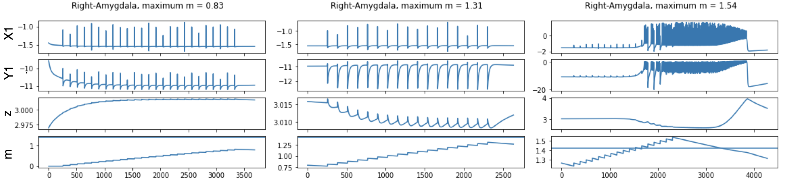
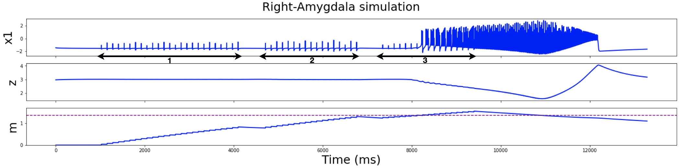

# Stimulate different regions TVB simulation

The main code is located in `stimulate_different_roi.py` 

The other files contain dependencies for that main file.

There, 3 consecutive simulations are executed, where different brain regions are stimulated one after the other. This is the equivalent of running one single simulation and performing three different stimulations from different electrode pairs and different electric fields one after the other. The consecutive stimulations have an accumulative effect that triggers a seizure. 

Here is the final result of that simulation for one brain region of interest (an epileptogenic zone) where a seizure was triggered following three stimulations.

And the grouped simulation looks like this: 

Nice, amirite? 
